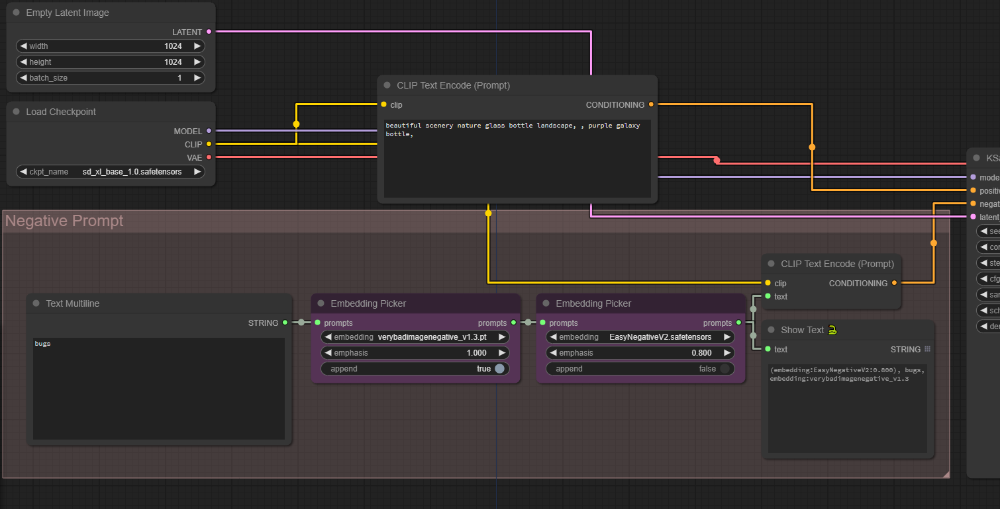

# Embedding Picker

Tired of forgetting and misspelling often weird names of embeddings you use?
Or perhaps you use only one, cause you forgot you have tens of them installed?

Try this.

### Note to existing users:

Version v2 will cause validation error in workflows that used previous version. There's nothing to worry about, simply replace error causing nodes with new ones, or stick to version v1

# Installation

Exactly the same as with other simple custom nodes.

- Click the green **Code** button, select **Download Zip**, and unpack it in your ComfyUI `custom_nodes` directory

or

- Clone this repository by running `git clone https://github.com/Tropfchen/ComfyUI-Embedding_Picker.git` in your ComfyUI `custom_nodes` directory

To uninstall:

- Delete the `ComfyUi_Embedding_Picker` in your ComfyUI custom_nodes directory and `epQuickNodes.js` file in `ComfyUI\web\extensions\tropf` directory

# Use

Right click on the _CLIP Text Encode_ node and select the top option 'Prepend Embedding Picker'. This will create the node itself and copy all your prompts.
A similar option exists on the `Embedding Picker' node itself, use this to quickly chain multiple embeddings.

You can also find the node in `utils` menu.

By default the embedding will be the placed as first prompt, and will result in such text

> embedding:EasyNegative.pt, text, watermark

Set `append` to True if you prefer it to be at the end, i. e.

> text, watermark, embedding:EasyNegative.pt

## Example Workflow

